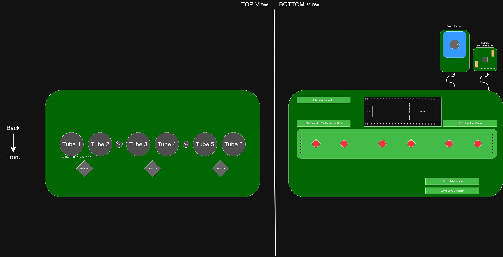
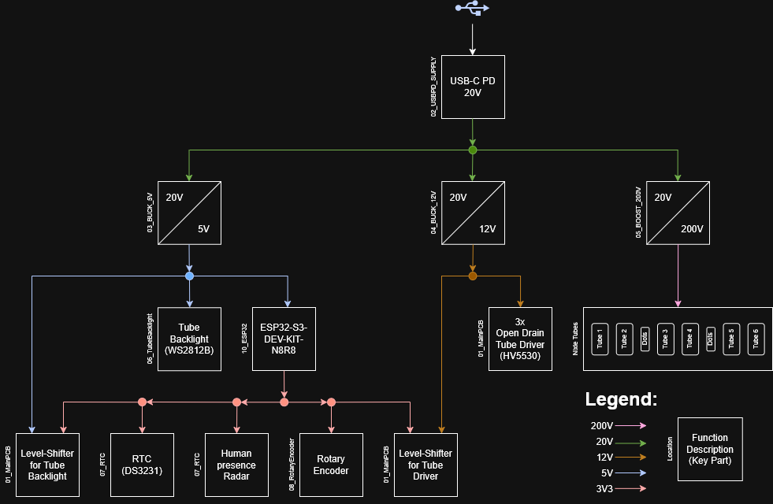
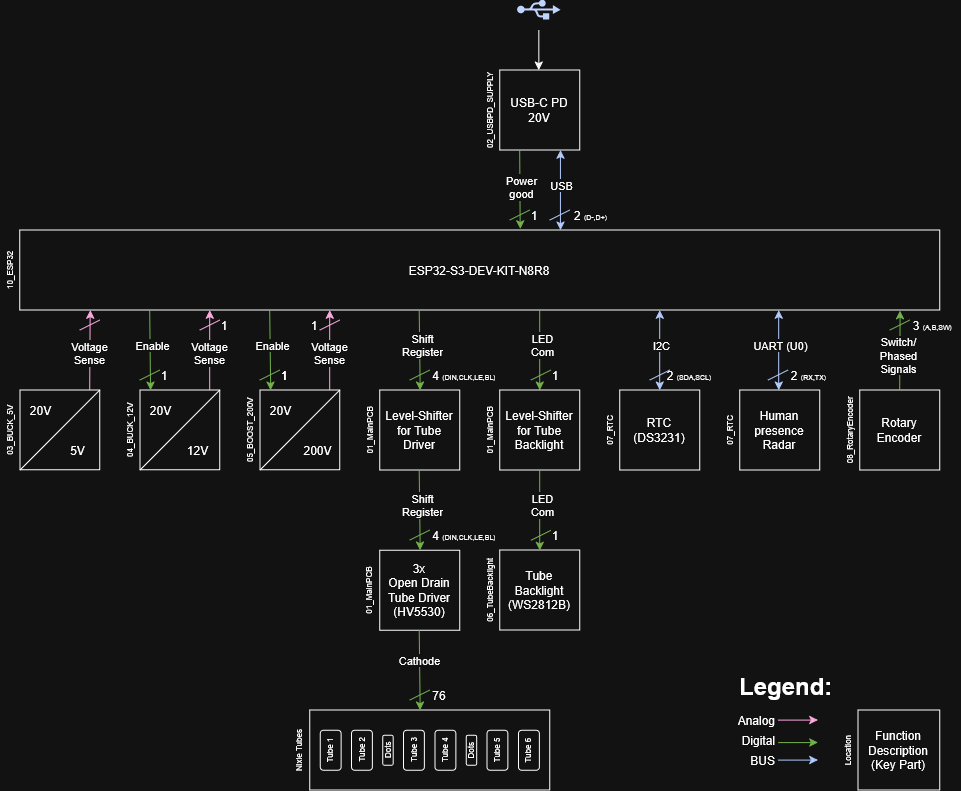

# Architecture

## Overview

  

## Power Tree

  

## Signal Flow

  

## Modules
  ### 01_MainPCB
  1. 
  2. ...
  ### 02_USBPD_Supply
  1. 
  2. ...
  ### 03_Buck_12V
  1. 
  2. ...
  ### 04_Buck_5V
  1. 
  2. ...
  ### 05_Boost_200V
  1. 
  2. ...
  ### 06_RotaryEncoder
  1. 
  2. ...