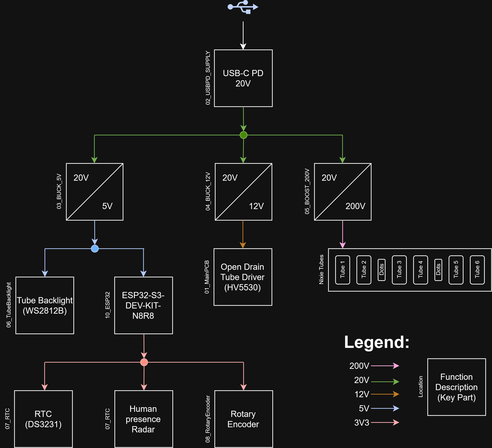

# Requirements — Nixie Clock

## Display
- 6x IN-14 Nixie tubes
- Driven via HV5530PG-G

## Power
- Input: USB-C Power Delivery, 20V
- 20V → 200V (boost, LT3757) for Nixie tubes
- 20V → 12V (buck, OTS IC) for Nixie driver
- 20V → 5V (buck, OTS IC) for ESP32

## Power Tree

  

## Timekeeping
- Primary: NTP sync via WiFi
- Fallback: DS3231 RTC (CR2032 backup battery) when WiFi/NTP unavailable
- Manual time set via rotary encoder when in fallback mode

## Sensing
- Human presence: Waveshare 24GHz FMCW mmWave radar (GPIO/UART, 3.3V)

## Compute
- Waveshare ESP32-S3-DEV-KIT-N8R8

## Mechanical
- Simple wooden housing

## Modularity
- Each module (power stages, driver, encoder) is a separate PCB, designed individually
- Main PCB interconnects all modules

## Non-goals / out of scope
- tbd